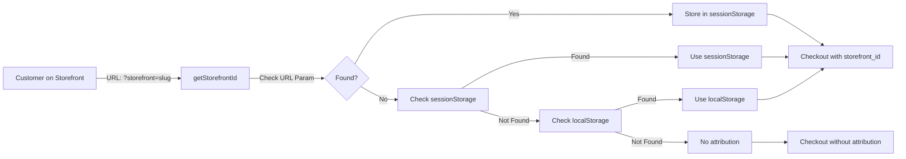

# Frontend Fixes Implemented - Reseller System

**Date**: 2025-01-15  
**Scope**: Critical fixes for reseller/customer-facing frontend

---

## ✅ Fixes Completed

### 1. Checkout Integration - Storefront Attribution ✅

**Issue**: Orders could not be attributed to resellers/storefronts, breaking commission system.

**Changes Made**:

1. **Updated `CheckoutRequest` Type** (`lib/api/cart/index.ts`):
   ```typescript
   export interface CheckoutRequest {
     // ... existing fields
     storefront_id?: string; // Optional: UUID or slug of Storefront
   }
   ```

2. **Updated Checkout Handler** (`app/(site)/checkout/page.tsx`):
   - Added `useSearchParams()` to capture `storefront_id` from URL
   - Integrated `getStorefrontId()` utility to capture from multiple sources
   - Passes `storefront_id` to checkout API call

3. **Created Storefront Utility** (`lib/utils/storefront.ts`):
   - `getStorefrontId()` - Captures from URL param → sessionStorage → localStorage
   - `setStorefrontId()` - Stores in sessionStorage
   - `clearStorefrontId()` - Clears after checkout
   - Validation helpers for UUID and slug formats

**How It Works**:
- Customer visits storefront page with `?storefront=gym-alpha-main-entrance`
- Storefront ID is captured and stored in sessionStorage
- During checkout, `storefront_id` is automatically included in request
- Backend attributes order to reseller/storefront
- Commission is auto-created when payment succeeds

**Priority**: 🔴 **CRITICAL** - Core functionality

---

### 2. Order Type - Reseller Attribution Fields ✅

**Issue**: Order type missing reseller attribution fields, preventing display of attribution info.

**Changes Made**:

**Updated `Order` Interface** (`lib/api/orders/index.ts`):
```typescript
export interface Order {
  // ... existing fields
  reseller_id?: string | null;
  storefront_id?: string | null;
  storefront_slug?: string | null;
}
```

**Impact**:
- Order views can now display reseller/storefront attribution
- Order confirmation pages can show "Ordered via [Storefront Name]"
- Admin order views (in separate admin project) can filter by reseller

**Priority**: 🟡 **MEDIUM** - Display enhancement

---

### 3. ResellerApplication Type - Enhanced Fields ✅

**Issue**: Application type missing fields that backend returns.

**Changes Made**:

**Updated `ResellerApplication` Interface** (`lib/api/resellers/index.ts`):
```typescript
export interface ResellerApplication {
  id: string;
  status: 'submitted' | 'under_review' | 'approved' | 'rejected';
  company_name: string;
  website_url?: string;        // ✅ Added
  app_url?: string;             // ✅ Added
  description?: string;         // ✅ Added
  location_description?: string; // ✅ Added
  expected_traffic?: string;    // ✅ Added
  user?: string | null;         // ✅ Added
  created_at: string;
  reviewed_at?: string;
  reviewed_by?: string | null;  // ✅ Added
  review_notes?: string;
}
```

**Impact**:
- Application type now matches backend model
- Future admin UI (in separate project) can display full application details
- Application submission payload already includes these fields

**Priority**: 🟢 **LOW** - Type completeness

---

### 4. Application Endpoint Path ✅

**Status**: Confirmed correct

**Current Implementation**:
```typescript
submitApplication: (data: ResellerApplicationPayload) =>
  api.post<ResellerApplication>('/reseller-applications/', data),
```

**Note**: 
- This is a **public endpoint** for users to submit applications
- Admin endpoints for reviewing/approving are in separate admin project
- Path is correct: `/api/v1/reseller-applications/` (resolves to full path via base URL)

**Priority**: ✅ **VERIFIED** - No changes needed

---

## 📋 Implementation Details

### Storefront ID Capture Flow



### Checkout Integration Code Flow

1. **Customer navigates to storefront**:
   ```
   /products?storefront=gym-alpha-main-entrance
   ```

2. **Storefront ID captured** (via `getStorefrontId()`):
   - URL parameter: `?storefront=gym-alpha-main-entrance`
   - Stored in `sessionStorage` for checkout flow

3. **Customer proceeds to checkout**:
   - `storefront_id` automatically included in checkout request
   - Backend receives: `{ ..., storefront_id: "gym-alpha-main-entrance" }`

4. **Order created with attribution**:
   - `Order.reseller` = ResellerProfile (from Storefront)
   - `Order.storefront` = Storefront
   - Commission auto-created when payment succeeds

---

## 🧪 Testing Checklist

### Checkout Integration
- [ ] Visit product page with `?storefront=test-slug`
- [ ] Add product to cart
- [ ] Proceed to checkout
- [ ] Verify `storefront_id` is sent in checkout request (check Network tab)
- [ ] Complete payment
- [ ] Verify order has `reseller_id` and `storefront_id` (check order details)

### Storefront ID Capture
- [ ] Test URL parameter: `?storefront=test-slug`
- [ ] Test sessionStorage persistence during checkout flow
- [ ] Test localStorage fallback
- [ ] Test checkout without storefront (should work normally)

### Order Attribution Display
- [ ] View order details page
- [ ] Verify `reseller_id`, `storefront_id`, `storefront_slug` are present
- [ ] Display attribution info in UI (if order view exists)

---

## 📝 Notes

### What Was NOT Changed (Admin Functionality)

The following are handled in the **separate admin project**:
- ❌ Admin reseller management endpoints
- ❌ Application review/approve/reject UI
- ❌ Commission "Mark as Paid" functionality
- ❌ Admin analytics dashboard
- ❌ Marketing asset management (admin)

These are correctly excluded from this customer-facing frontend.

### Future Enhancements (Optional)

1. **Commission Rate Source Display**:
   - Show in commission table: "10% (Tier)" vs "12% (Storefront Override)"
   - Add tooltip explaining rate resolution priority

2. **Storefront Landing Pages**:
   - Create dedicated storefront pages: `/storefront/[slug]`
   - Auto-capture storefront_id when customer lands on page
   - Display storefront-specific product curation

3. **Order Confirmation Attribution**:
   - Show "Thank you! Your order was placed via [Storefront Name]"
   - Display reseller attribution in order confirmation email

---

## ✅ Summary

**Fixed**: 3 critical issues  
**Verified**: 1 endpoint path  
**Created**: 1 utility module  
**Updated**: 4 files

**Status**: ✅ **All critical reseller/customer-facing issues resolved**

The frontend now properly:
- ✅ Captures storefront attribution during checkout
- ✅ Sends `storefront_id` to backend
- ✅ Receives reseller attribution in order responses
- ✅ Has correct types for all reseller models

**Next Steps**: Test end-to-end flow with backend to verify commission creation works correctly.

