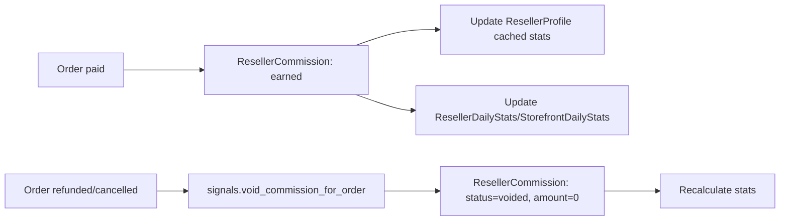

# Reseller & Partner Portal Architecture Documentation

## Overview

The Reseller module implements a **commission-based reseller / partner portal** (not wholesale pricing).
Resellers use curated digital storefronts (e.g. gym screens, partner links) to drive retail orders on the
main e‑commerce platform. Payments, pricing, and fulfillment remain fully owned by the brand; the system
tracks attribution and commissions per **reseller** and **storefront**, with analytics and admin tools.

Key goals:

- Multi-storefront support per reseller (locations, screens, links).
- Tiered commissions (Bronze/Silver/Gold/Platinum).
- Order attribution (reseller + storefront) without changing core checkout UX.
- Commission ledger, payouts, and analytics for both resellers and admins.
- Marketing material delivery by tier.

## Design Patterns

1. **Service Layer Pattern**
   - Business logic lives in `resellers/services.py` (e.g. commission calculation, stats updates).
   - Views are thin and delegate to services.

2. **Attribution-First Design**
   - Orders are attributed via `Order.reseller` and `Order.storefront`.
   - Commission and analytics are derived from orders, not vice versa.

3. **Async-Friendly Analytics**
   - `ResellerDailyStats` and `StorefrontDailyStats` provide pre-aggregated metrics.
   - Celery tasks (`resellers/tasks.py`) can rebuild or recompute stats for specific dates.

4. **RBAC Integration**
   - Uses existing `users.permissions.HasPermission` and the Role/Group system.
   - `IsResellerUser` guards reseller-portal endpoints.
   - Admin endpoints require `resellers.*` model permissions.

5. **Swagger-First APIs**
   - All endpoints documented with `drf_spectacular` via `@extend_schema`.
   - Request bodies, parameters, and responses explicitly described.

## Data Models

### ResellerTier

- **Purpose**: Configure commission tiers (Bronze/Silver/Gold/Platinum).
- **Location**: `resellers/models.py`
- **Fields** (key ones):
  - `id` (UUID PK)
  - `name` (slug, e.g. `bronze`)
  - `display_name` (e.g. `"Bronze Tier"`)
  - `description`
  - `commission_rate` (`Decimal`, 0–1; e.g. 0.10 for 10%)
  - `min_payout_threshold` (`Decimal`)
  - `is_active`
  - `created_at`, `updated_at`

### ResellerProfile

- **Purpose**: Attach reseller metadata to a `User` (`role="reseller"`).
- **Fields**:
  - `id` (UUID PK)
  - `user` (`OneToOneField` to `users.User`, `related_name="reseller_profile"`)
  - `tier` (`ForeignKey` to `ResellerTier`)
  - Company info: `company_name`, `legal_name`, `vat_number`, `website_url`
  - Contact info: `contact_name`, `contact_email`, `contact_phone`
  - `status`: `pending`, `approved`, `rejected`, `suspended`
  - `approved_at`, `approved_by`
  - Payout config: `payout_method`, `payout_details` (JSON)
  - `default_commission_rate` (optional override)
  - Cached stats: `lifetime_gmv`, `lifetime_commission`, `orders_count`
  - `created_at`, `updated_at`

### ResellerApplication

- **Purpose**: Onboarding requests from potential resellers.
- **Fields**:
  - `id` (UUID PK)
  - `user` (optional FK to `User`)
  - `company_name`, `website_url`, `app_url`
  - `description`, `location_description`, `expected_traffic`
  - `status`: `submitted`, `under_review`, `approved`, `rejected`
  - `review_notes`, `reviewed_by`, `reviewed_at`
  - `created_at`, `updated_at`

### Storefront

- **Purpose**: A sales surface owned by a reseller (gym screen, microsite, link).
- **Fields**:
  - `id` (UUID PK)
  - `reseller` (`ForeignKey` to `ResellerProfile`, `related_name="storefronts"`)
  - `name`
  - `slug` (unique, used by frontend e.g. `"gym-x-main-entrance"`)
  - `type`: `online`, `physical_screen`, `link`
  - Optional location: `address_line1`, `city`, `country`, `notes`
  - `commission_rate_override` (optional per-storefront override)
  - `is_active`
  - `created_at`, `updated_at`

### StorefrontProduct

- **Purpose**: Curated product assignments per storefront.
- **Fields**:
  - `id` (UUID PK)
  - `storefront` (FK to `Storefront`)
  - `product` (FK to `products.Product`)
  - `position` (for manual ordering)
  - `is_featured`
  - `notes`
  - `created_at`
- **Constraints**:
  - `unique_together = ("storefront", "product")`

### Order Attribution (Orders app)

- **Location**: `orders/models.py`
- **Additions to `Order`**:
  - `reseller` (`ForeignKey` to `resellers.ResellerProfile`, nullable, `related_name="orders"`)
  - `storefront` (`ForeignKey` to `resellers.Storefront`, nullable, `related_name="orders"`)
- **Indexes**:
  - `Index(['reseller', '-created_at'])`
  - `Index(['storefront', '-created_at'])`

### ResellerCommission

- **Purpose**: Commission ledger entries per order.
- **Fields**:
  - `id` (UUID PK)
  - `order` (FK to `orders.Order`, `related_name="reseller_commissions"`)
  - `reseller` (FK to `ResellerProfile`, `related_name="commissions"`)
  - `storefront` (FK to `Storefront`, nullable, `related_name="commissions"`)
  - `base_amount` (Decimal) — **product subtotal after discounts, excl. VAT & shipping**
  - `commission_rate` (Decimal)
  - `commission_amount` (Decimal)
  - `status`: `pending`, `earned`, `voided`, `paid`
  - `earned_at`, `paid_at`
  - `void_reason`
  - `metadata` (JSON)
  - `created_at`, `updated_at`
- **Constraints**:
  - `unique_together = ("order", "reseller")`

### ResellerDailyStats & StorefrontDailyStats

- **Purpose**: Pre-aggregated analytics for dashboards.
- **ResellerDailyStats**:
  - `id`, `reseller`, `date`
  - `orders_count`, `gmv`, `commission_amount`, `new_customers_count`
- **StorefrontDailyStats**:
  - `id`, `storefront`, `date`
  - `orders_count`, `gmv`, `commission_amount`

### MarketingAsset

- **Purpose**: Marketing materials accessible to resellers.
- **Fields**:
  - `id`, `title`, `description`
  - `file` (FileField) and/or `url`
  - `asset_type`: `image`, `video`, `pdf`, `copy`, `other`
  - Visibility:
    - `min_tier` (FK to `ResellerTier`, optional)
    - `allowed_tiers` (M2M to `ResellerTier`, optional allow-list)
  - `is_active`, `created_at`, `updated_at`

## Core Flows

### 1. Attribution & Checkout Flow

```mermaid
flowchart LR
  customer[Customer] --> storefrontPage[Storefront page]
  storefrontPage -->|"storefront_id in checkout payload"| checkoutAPI[POST /cart/checkout/]
  checkoutAPI -->|create_order_from_cart| order[Order (with reseller+storefront)]
  order --> payments[Stripe Checkout]
  payments -->|VerifyPaymentView: payment_status -> paid| commissionService[create_commission_for_order]
  commissionService --> commission[ResellerCommission]
  commission --> stats[Daily Stats + Reseller cached stats]
```

1. Frontend calls `POST /api/v1/cart/checkout/` and includes optional `storefront_id`:
   - `storefront_id` can be a **UUID** or **slug** of `Storefront`.
2. `CheckoutView` calls `orders.services.create_order_from_cart(...)` with `storefront_id`.
3. `create_order_from_cart`:
   - Resolves `Storefront` by `id` or `slug`.
   - Sets `Order.storefront` and `Order.reseller`.
4. Payment is created and processed via Stripe.
5. `VerifyPaymentView` updates `order.payment_status` to `"paid"`.
6. `resellers.signals.handle_order_payment_status_change` listens to `post_save(Order)`:
   - For `payment_status == "paid"`, calls `create_commission_for_order(order)`.
7. `create_commission_for_order`:
   - Computes `base_amount` as sum of `OrderItem.subtotal`.
   - Resolves `commission_rate` from `Storefront` → `ResellerProfile` → `ResellerTier`.
   - Creates `ResellerCommission` and updates stats.

### 2. Commission & Refund Flow



- `void_commission_for_order(order, reason)`:
  - Marks existing `ResellerCommission` entries as `voided`.
  - Moves previous values into `metadata["previous_commission_amount"]`.
  - Sets `commission_amount` to 0 and triggers stat updates.

### 3. Reseller Onboarding Flow (Admin)

```mermaid
flowchart LR
  app[ResellerApplication] --> adminReview[Admin reviews]
  adminReview -->|Approve| createProfile[Create/Update ResellerProfile]
  createProfile --> setUserRole[User.role='reseller']
  createProfile --> tierAssign[Assign initial tier (Bronze)]
  adminReview -->|Reject| appRejected[Application status=rejected]
```

- Approval uses `AdminApproveResellerApplicationView`:
  - Ensures `ResellerTier` exists (defaults to `"bronze"` if configured).
  - Creates or updates `ResellerProfile`.
  - Sets `User.role = "reseller"` when applicable.

## Services

Location: `resellers/services.py`.

Key functions:

- `build_commission_context(order) -> CommissionContext | None`
  - Computes base amount and effective commission rate for an order.
- `create_commission_for_order(order) -> ResellerCommission | None`
  - Idempotently creates a commission entry when `order.payment_status == "paid"`.
  - Updates `ResellerProfile` cached stats and daily stats.
- `void_commission_for_order(order, reason="")`
  - Voids commissions when an order is cancelled/refunded.
- `update_reseller_cached_stats(reseller)`
  - Recalculates `lifetime_gmv`, `lifetime_commission`, `orders_count`.
- `update_daily_stats_for_order(order, commission)`
  - Upserts `ResellerDailyStats` and `StorefrontDailyStats`.
- `get_reseller_for_user(user)`
  - Convenience helper used by views.

## Signals

Location: `resellers/signals.py`.

- `handle_order_payment_status_change` (`post_save(Order)`):
  - On `payment_status == "paid"` → `create_commission_for_order(order)`.
  - On `payment_status == "refunded"` or `status in {"cancelled", "refunded"}` → `void_commission_for_order(order, ...)`.

## Celery Tasks

Location: `resellers/tasks.py`.

- `recalculate_reseller_daily_stats_for_date(target_date: str)`
  - Rebuilds `ResellerDailyStats` and `StorefrontDailyStats` for a specific date
    from `ResellerCommission` entries.
  - Useful for backfills or corrections.

You can schedule this task via `django_celery_beat` for periodic re-aggregation if needed.

## Permissions

Location: `resellers/permissions.py` + core `users.permissions`.

- `IsResellerUser`
  - Checks that `request.user` is authenticated and has `user.reseller_profile`.
  - Used on reseller-portal endpoints.

- `HasResellerPermission`
  - Thin wrapper around `users.permissions.HasPermission`.
  - Used on admin endpoints with codenames like:
    - `resellers.view_resellerprofile`
    - `resellers.change_resellerprofile`
    - `resellers.view_resellerapplication`
    - `resellers.change_resellerapplication`
    - `resellers.view_resellercommission`
    - `resellers.change_resellercommission`

## API Endpoints

All paths are under `"/api/v1/"` and documented with Swagger (`/api/docs/`).

### Reseller Portal (Self-Service)

- `GET /api/v1/resellers/me/`
  - **Purpose**: Get current reseller profile & summary stats.
  - **Auth**: JWT, `IsAuthenticated` + `IsResellerUser`.
  - **Response**: `ResellerMeSerializer` (tier, status, stats).

- `PATCH /api/v1/resellers/me/profile/`
  - **Purpose**: Reseller updates own company/contact info.
  - **Auth**: `IsAuthenticated` + `IsResellerUser`.
  - **Request**: `ResellerSelfProfileUpdateSerializer`.

- `GET /api/v1/resellers/storefronts/`
- `POST /api/v1/resellers/storefronts/`
  - Manage storefronts for current reseller.

- `GET /api/v1/resellers/storefronts/{id}/`
- `PATCH /api/v1/resellers/storefronts/{id}/`
  - Retrieve/update a storefront.

- `GET /api/v1/resellers/storefronts/{storefront_id}/products/`
  - List curated products for a storefront.

- `POST /api/v1/resellers/storefronts/{storefront_id}/products/bulk-add/`
  - Add multiple products to a storefront by product IDs.

- `DELETE /api/v1/resellers/storefronts/{storefront_id}/products/{product_id}/`
  - Remove a product from a storefront.

- `GET /api/v1/resellers/commissions/`
  - Commission ledger for current reseller (filter: status, storefront, date range).

- `GET /api/v1/resellers/commissions/summary/`
  - Summary metrics for current month and last 30 days.

- `GET /api/v1/resellers/analytics/overview/`
  - Dashboard view: total orders, GMV, commission, top storefronts.

- `GET /api/v1/resellers/marketing-assets/`
- `GET /api/v1/resellers/marketing-assets/{id}/`
  - Tier-aware marketing asset list and detail.

### Admin - Resellers

- `GET /api/v1/admin/resellers/`
- `GET /api/v1/admin/resellers/{id}/`
  - Admin list/detail view of resellers with filters.

- `GET /api/v1/admin/reseller-applications/`
- `GET /api/v1/admin/reseller-applications/{id}/`
  - View reseller onboarding applications.

- `POST /api/v1/admin/reseller-applications/{id}/approve/`
  - Approve application, create/update profile, set user role, assign tier.

- `POST /api/v1/admin/reseller-applications/{id}/reject/`
  - Reject application with reason.

- `GET /api/v1/admin/reseller-commissions/`
  - Global commission ledger with rich filters.

- `POST /api/v1/admin/reseller-commissions/{id}/mark-paid/`
  - Mark a commission entry as paid for payout tracking.

- `GET /api/v1/admin/reseller-analytics/overview/`
  - Aggregated analytics across resellers, with top performer list.

### Checkout & Frontend Integration

- `POST /api/v1/cart/checkout/`
  - Existing checkout flow, now extended with optional `storefront_id` field.
  - **Request** (new field only):
    - `storefront_id` (string): UUID or slug of `Storefront`.
  - If provided and valid, order is attributed to that storefront and its reseller.

- `GET /api/v1/orders/{id}/`
  - `OrderSerializer` now includes:
    - `reseller_id`
    - `storefront_id`
    - `storefront_slug`

## Integration Points

### Users

- Resellers are regular `users.User` records with:
  - `user.role = "reseller"` (simple role flag).
  - Linked `ResellerProfile`.
- Approval flow updates user role, but permission groups/roles can be managed using existing Access Manager.

### Orders

- `Order` gains `reseller` and `storefront` FKs.
- `create_order_from_cart` handles attribution from checkout payload.
- `ResellerCommission` is always driven from `Order` state.

### Payments

- `payments.services.create_checkout_session` adds attribution to Stripe metadata:
  - `reseller_id`, `storefront_id`, `storefront_slug` (if present).

### CRM & Marketing (Optional)

- Future extensions can:
  - Tag contacts as reseller-origin customers.
  - Use reseller/storefront in marketing segmentation and BI dashboards.

## Testing Strategy

- **Unit tests** (`resellers/tests.py`):
  - Commission calculation from paid orders (base_amount and commission_amount).
  - Future extension: API tests for `/resellers/me/` and ledger endpoints.
- **Integration tests**:
  - Checkout + VerifyPaymentView + signals → commission flow.
  - Admin approval flow → application to profile.
- **Manual checks**:
  - Swagger (`/api/docs/`) shows all new endpoints and fields.
  - Admin panel lists tiers, resellers, storefronts, commissions, and marketing assets.


