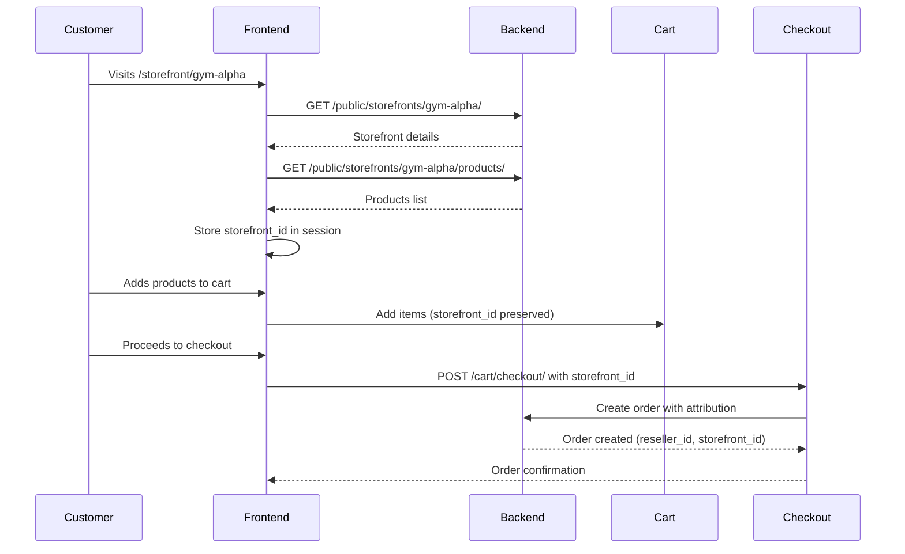

# Reseller Storefront Sharing - Frontend Integration Guide

## Table of Contents

1. [Overview](#overview)
2. [New API Endpoints](#new-api-endpoints)
3. [Integration Steps](#integration-steps)
4. [Code Examples](#code-examples)
5. [Storefront Attribution Flow](#storefront-attribution-flow)
6. [Sharing UI Implementation](#sharing-ui-implementation)
7. [Error Handling](#error-handling)
8. [Best Practices](#best-practices)

---

## Overview

This guide explains how to integrate the new public storefront endpoints and sharing functionality into your frontend application. These endpoints enable resellers to share their storefronts with customers, and customers to browse and purchase products from reseller storefronts.

### What's New

- **Public Storefront Endpoints**: Allow customers to view storefronts without authentication
- **Storefront Sharing API**: Provides resellers with shareable URLs and codes
- **Product Attribution**: Ensures orders are correctly attributed to resellers

---

## New API Endpoints

### 1. Public Storefront Detail

**Endpoint**: `GET /api/v1/public/storefronts/{slug}/`

**Purpose**: Get storefront information by slug (public access)

**Authentication**: None required

**URL Parameters**:
- `slug` (string, required): Storefront slug (e.g., "gym-alpha-main-entrance")

**Response**:
```json
{
  "id": "uuid",
  "name": "Gym Alpha Main Entrance",
  "slug": "gym-alpha-main-entrance",
  "type": "physical_screen",
  "address_line1": "123 Main St",
  "city": "London",
  "country": "UK",
  "reseller_company_name": "Gym Alpha Co",
  "created_at": "2025-01-15T10:00:00Z"
}
```

**Response Fields**:
- `id` (UUID): Storefront ID
- `name` (string): Display name
- `slug` (string): URL-friendly identifier
- `type` (string): "online" | "physical_screen" | "link"
- `address_line1` (string, nullable): Street address
- `city` (string, nullable): City name
- `country` (string, nullable): Country name
- `reseller_company_name` (string): Reseller's company name
- `created_at` (datetime): Creation timestamp

**Error Responses**:
- `404 Not Found`: Storefront doesn't exist or is inactive

---

### 2. Public Storefront Products

**Endpoint**: `GET /api/v1/public/storefronts/{slug}/products/`

**Purpose**: Get list of products curated for a storefront (public access)

**Authentication**: None required

**URL Parameters**:
- `slug` (string, required): Storefront slug

**Query Parameters**:
- `ordering` (string, optional): Order by field
  - Options: `position`, `created_at`, `price`
  - Default: `position`, `created_at`
- `page` (integer, optional): Page number for pagination
- `page_size` (integer, optional): Items per page

**Response**:
```json
{
  "count": 10,
  "next": "http://api.example.com/api/v1/public/storefronts/gym-alpha/products/?page=2",
  "previous": null,
  "results": [
    {
      "id": "product-uuid",
      "title": "Protein Powder 2kg",
      "name": "Protein Powder 2kg",
      "description": "High-quality protein powder...",
      "price": "49.99",
      "retail_price": "49.99",
      "imageUrl": "https://example.com/images/product.jpg",
      "images": [...],
      "variants": [...],
      "category": "Supplements",
      "is_active": true,
      "availabilityStatus": "in_stock",
      "total_stock": 50,
      "average_rating": 4.5,
      "review_count": 23,
      ...
    }
  ]
}
```

**Response Fields** (Product object):
- Uses `ProductListSerializer` from products app
- Includes all standard product fields (title, price, images, variants, etc.)
- Products are filtered to only active products
- Ordered by position in storefront, then creation date

**Error Responses**:
- `404 Not Found`: Storefront doesn't exist or is inactive

---

### 3. Storefront Sharing Information

**Endpoint**: `GET /api/v1/resellers/storefronts/{storefront_id}/sharing/`

**Purpose**: Get sharing URLs and codes for a storefront (reseller only)

**Authentication**: JWT token + Reseller role required

**URL Parameters**:
- `storefront_id` (UUID, required): Storefront UUID

**Response**:
```json
{
  "share_url": "https://yourstore.com/storefront/gym-alpha-main-entrance",
  "direct_link": "https://yourstore.com/products?storefront=gym-alpha-main-entrance",
  "qr_code_data": "https://yourstore.com/storefront/gym-alpha-main-entrance",
  "embed_code": "<iframe src=\"https://yourstore.com/storefront/gym-alpha-main-entrance\" width=\"100%\" height=\"600\" frameborder=\"0\"></iframe>"
}
```

**Response Fields**:
- `share_url` (string): Direct storefront page URL
- `direct_link` (string): Products page with storefront query parameter
- `qr_code_data` (string): URL to encode in QR code
- `embed_code` (string): HTML iframe code for embedding

**Error Responses**:
- `401 Unauthorized`: Not authenticated
- `403 Forbidden`: Not a reseller or storefront not owned by user
- `404 Not Found`: Storefront doesn't exist

---

## Integration Steps

### Step 1: Create Storefront Page Route

Create a new route in your frontend router:

**Next.js Example**:
```typescript
// pages/storefront/[slug].tsx or app/storefront/[slug]/page.tsx
import { useRouter } from 'next/router';
import { useEffect, useState } from 'react';

export default function StorefrontPage() {
  const router = useRouter();
  const { slug } = router.query;
  const [storefront, setStorefront] = useState(null);
  const [products, setProducts] = useState([]);
  const [loading, setLoading] = useState(true);

  useEffect(() => {
    if (!slug) return;
    
    // Fetch storefront details
    fetch(`/api/v1/public/storefronts/${slug}/`)
      .then(res => res.json())
      .then(data => {
        setStorefront(data);
        // Store storefront_id in session for checkout
        sessionStorage.setItem('storefront_id', data.slug);
      });

    // Fetch products
    fetch(`/api/v1/public/storefronts/${slug}/products/`)
      .then(res => res.json())
      .then(data => {
        setProducts(data.results);
        setLoading(false);
      });
  }, [slug]);

  if (loading) return <div>Loading...</div>;
  if (!storefront) return <div>Storefront not found</div>;

  return (
    <div>
      <h1>{storefront.name}</h1>
      <p>By {storefront.reseller_company_name}</p>
      <div className="products-grid">
        {products.map(product => (
          <ProductCard key={product.id} product={product} />
        ))}
      </div>
    </div>
  );
}
```

**React Router Example**:
```typescript
// routes/StorefrontRoute.tsx
import { useParams } from 'react-router-dom';

export function StorefrontRoute() {
  const { slug } = useParams<{ slug: string }>();
  // Similar implementation as above
}
```

### Step 2: Update Checkout to Include Storefront ID

Modify your checkout function to include `storefront_id`:

```typescript
async function checkout(cartItems: CartItem[], address: Address) {
  // Get storefront_id from session/localStorage if exists
  const storefrontId = sessionStorage.getItem('storefront_id') || 
                       localStorage.getItem('storefront_id');

  const response = await fetch('/api/v1/cart/checkout/', {
    method: 'POST',
    headers: {
      'Content-Type': 'application/json',
      'Authorization': `Bearer ${token}` // If authenticated
    },
    body: JSON.stringify({
      shipping_address: address.street,
      city: address.city,
      state: address.state,
      zip_code: address.zipCode,
      country: address.country,
      email: address.email,
      storefront_id: storefrontId // ← Add this
    })
  });

  const data = await response.json();
  
  // Clear storefront_id after checkout
  sessionStorage.removeItem('storefront_id');
  localStorage.removeItem('storefront_id');
  
  return data;
}
```

### Step 3: Add Sharing UI to Reseller Portal

Create a sharing component for resellers:

```typescript
// components/reseller/StorefrontSharing.tsx
import { useState, useEffect } from 'react';

interface SharingData {
  share_url: string;
  direct_link: string;
  qr_code_data: string;
  embed_code: string;
}

export function StorefrontSharing({ storefrontId }: { storefrontId: string }) {
  const [sharingData, setSharingData] = useState<SharingData | null>(null);
  const [copied, setCopied] = useState(false);

  useEffect(() => {
    fetch(`/api/v1/resellers/storefronts/${storefrontId}/sharing/`, {
      headers: {
        'Authorization': `Bearer ${token}`
      }
    })
      .then(res => res.json())
      .then(data => setSharingData(data));
  }, [storefrontId]);

  const copyToClipboard = (text: string) => {
    navigator.clipboard.writeText(text);
    setCopied(true);
    setTimeout(() => setCopied(false), 2000);
  };

  if (!sharingData) return <div>Loading...</div>;

  return (
    <div className="sharing-panel">
      <h3>Share Your Storefront</h3>
      
      <div className="share-option">
        <label>Share URL</label>
        <div className="input-group">
          <input 
            type="text" 
            value={sharingData.share_url} 
            readOnly 
          />
          <button onClick={() => copyToClipboard(sharingData.share_url)}>
            {copied ? 'Copied!' : 'Copy'}
          </button>
        </div>
      </div>

      <div className="share-option">
        <label>Direct Link</label>
        <div className="input-group">
          <input 
            type="text" 
            value={sharingData.direct_link} 
            readOnly 
          />
          <button onClick={() => copyToClipboard(sharingData.direct_link)}>
            Copy
          </button>
        </div>
      </div>

      <div className="share-option">
        <label>QR Code</label>
        <QRCode value={sharingData.qr_code_data} />
        <p>Scan to visit storefront</p>
      </div>

      <div className="share-option">
        <label>Embed Code</label>
        <textarea 
          value={sharingData.embed_code} 
          readOnly 
          rows={3}
        />
        <button onClick={() => copyToClipboard(sharingData.embed_code)}>
          Copy Embed Code
        </button>
      </div>
    </div>
  );
}
```

---

## Code Examples

### TypeScript Type Definitions

```typescript
// types/storefront.ts
export interface PublicStorefront {
  id: string;
  name: string;
  slug: string;
  type: 'online' | 'physical_screen' | 'link';
  address_line1?: string;
  city?: string;
  country?: string;
  reseller_company_name: string;
  created_at: string;
}

export interface StorefrontSharing {
  share_url: string;
  direct_link: string;
  qr_code_data: string;
  embed_code: string;
}

export interface StorefrontProductsResponse {
  count: number;
  next: string | null;
  previous: string | null;
  results: Product[]; // Use your existing Product type
}
```

### API Service Functions

```typescript
// services/storefrontApi.ts
const API_BASE = '/api/v1';

export async function getPublicStorefront(slug: string): Promise<PublicStorefront> {
  const response = await fetch(`${API_BASE}/public/storefronts/${slug}/`);
  if (!response.ok) {
    if (response.status === 404) {
      throw new Error('Storefront not found');
    }
    throw new Error('Failed to fetch storefront');
  }
  return response.json();
}

export async function getStorefrontProducts(
  slug: string,
  options?: { ordering?: string; page?: number; pageSize?: number }
): Promise<StorefrontProductsResponse> {
  const params = new URLSearchParams();
  if (options?.ordering) params.append('ordering', options.ordering);
  if (options?.page) params.append('page', options.page.toString());
  if (options?.pageSize) params.append('page_size', options.pageSize.toString());

  const url = `${API_BASE}/public/storefronts/${slug}/products/?${params}`;
  const response = await fetch(url);
  
  if (!response.ok) {
    if (response.status === 404) {
      throw new Error('Storefront not found');
    }
    throw new Error('Failed to fetch products');
  }
  return response.json();
}

export async function getStorefrontSharing(
  storefrontId: string,
  token: string
): Promise<StorefrontSharing> {
  const response = await fetch(
    `${API_BASE}/resellers/storefronts/${storefrontId}/sharing/`,
    {
      headers: {
        'Authorization': `Bearer ${token}`
      }
    }
  );
  
  if (!response.ok) {
    if (response.status === 401) {
      throw new Error('Authentication required');
    }
    if (response.status === 403) {
      throw new Error('Access denied');
    }
    if (response.status === 404) {
      throw new Error('Storefront not found');
    }
    throw new Error('Failed to fetch sharing information');
  }
  return response.json();
}
```

### React Hook for Storefront Data

```typescript
// hooks/useStorefront.ts
import { useState, useEffect } from 'react';
import { getPublicStorefront, getStorefrontProducts } from '../services/storefrontApi';

export function useStorefront(slug: string) {
  const [storefront, setStorefront] = useState<PublicStorefront | null>(null);
  const [products, setProducts] = useState<Product[]>([]);
  const [loading, setLoading] = useState(true);
  const [error, setError] = useState<string | null>(null);

  useEffect(() => {
    if (!slug) return;

    Promise.all([
      getPublicStorefront(slug),
      getStorefrontProducts(slug)
    ])
      .then(([storefrontData, productsData]) => {
        setStorefront(storefrontData);
        setProducts(productsData.results);
        setLoading(false);
        
        // Store storefront slug for checkout attribution
        sessionStorage.setItem('storefront_id', slug);
      })
      .catch(err => {
        setError(err.message);
        setLoading(false);
      });
  }, [slug]);

  return { storefront, products, loading, error };
}
```

---

## Storefront Attribution Flow

### Complete Customer Journey



### Implementation Checklist

- [ ] Create storefront page route (`/storefront/[slug]`)
- [ ] Fetch storefront details on page load
- [ ] Fetch storefront products on page load
- [ ] Store `storefront_id` (slug) in session/localStorage
- [ ] Display products in storefront layout
- [ ] Update add-to-cart to preserve `storefront_id`
- [ ] Update checkout to include `storefront_id` in request
- [ ] Clear `storefront_id` after successful checkout
- [ ] Handle 404 errors gracefully
- [ ] Add loading states
- [ ] Add error handling

---

## Sharing UI Implementation

### Reseller Portal Integration

Add sharing button to storefront list/detail:

```typescript
// pages/reseller/storefronts/[id].tsx
import { StorefrontSharing } from '@/components/reseller/StorefrontSharing';

export default function StorefrontDetailPage() {
  const { id } = useParams();
  const [showSharing, setShowSharing] = useState(false);

  return (
    <div>
      <h1>Storefront Details</h1>
      {/* Storefront details */}
      
      <button onClick={() => setShowSharing(!showSharing)}>
        Share Storefront
      </button>
      
      {showSharing && (
        <StorefrontSharing storefrontId={id} />
      )}
    </div>
  );
}
```

### QR Code Generation

Install QR code library:
```bash
npm install qrcode.react
# or
npm install react-qr-code
```

```typescript
// components/QRCode.tsx
import QRCodeReact from 'qrcode.react';

export function QRCode({ value }: { value: string }) {
  return (
    <div className="qr-code-container">
      <QRCodeReact value={value} size={200} />
    </div>
  );
}
```

---

## Error Handling

### Error Scenarios

1. **Storefront Not Found (404)**
```typescript
try {
  const storefront = await getPublicStorefront(slug);
} catch (error) {
  if (error.message === 'Storefront not found') {
    // Show "Storefront not found" message
    // Redirect to products page or 404 page
  }
}
```

2. **Network Errors**
```typescript
try {
  const products = await getStorefrontProducts(slug);
} catch (error) {
  // Show error message
  // Retry button or fallback UI
}
```

3. **Unauthorized Access (Sharing Endpoint)**
```typescript
try {
  const sharing = await getStorefrontSharing(id, token);
} catch (error) {
  if (error.message === 'Authentication required') {
    // Redirect to login
  } else if (error.message === 'Access denied') {
    // Show "You don't have permission" message
  }
}
```

### Error Component Example

```typescript
// components/StorefrontError.tsx
export function StorefrontError({ error }: { error: string }) {
  if (error === 'Storefront not found') {
    return (
      <div className="error-message">
        <h2>Storefront Not Found</h2>
        <p>This storefront doesn't exist or has been removed.</p>
        <Link href="/products">Browse All Products</Link>
      </div>
    );
  }

  return (
    <div className="error-message">
      <h2>Something Went Wrong</h2>
      <p>{error}</p>
      <button onClick={() => window.location.reload()}>
        Try Again
      </button>
    </div>
  );
}
```

---

## Best Practices

### 1. Storefront ID Persistence

**Use Session Storage** (preferred for single session):
```typescript
// Set when visiting storefront
sessionStorage.setItem('storefront_id', slug);

// Get during checkout
const storefrontId = sessionStorage.getItem('storefront_id');

// Clear after checkout
sessionStorage.removeItem('storefront_id');
```

**Use Local Storage** (if you want persistence across sessions):
```typescript
localStorage.setItem('storefront_id', slug);
```

**Use URL Query Parameter** (for direct links):
```typescript
// Extract from URL: /products?storefront=gym-alpha
const params = new URLSearchParams(window.location.search);
const storefrontId = params.get('storefront');
```

### 2. Loading States

Always show loading indicators:
```typescript
{loading ? (
  <div className="loading-spinner">Loading storefront...</div>
) : (
  <StorefrontContent storefront={storefront} products={products} />
)}
```

### 3. SEO Optimization

Add meta tags for storefront pages:
```typescript
<Head>
  <title>{storefront.name} - {storefront.reseller_company_name}</title>
  <meta name="description" content={`Browse products from ${storefront.reseller_company_name}`} />
  <meta property="og:title" content={storefront.name} />
  <meta property="og:description" content={`Products from ${storefront.reseller_company_name}`} />
</Head>
```

### 4. Performance

- **Cache storefront data** (if appropriate)
- **Lazy load products** with pagination
- **Optimize images** from product data
- **Use React.memo** for product cards

### 5. Accessibility

- **Alt text** for product images
- **ARIA labels** for sharing buttons
- **Keyboard navigation** support
- **Screen reader** friendly error messages

### 6. Analytics

Track storefront visits:
```typescript
useEffect(() => {
  if (storefront) {
    // Track storefront view
    analytics.track('storefront_viewed', {
      storefront_id: storefront.id,
      storefront_slug: storefront.slug,
      reseller: storefront.reseller_company_name
    });
  }
}, [storefront]);
```

---

## Summary

### Key Integration Points

1. **Public Storefront Page**: `/storefront/[slug]` route
2. **Product Display**: Use existing product components
3. **Checkout Integration**: Include `storefront_id` in checkout request
4. **Sharing UI**: Add to reseller portal storefront detail page
5. **Session Management**: Store `storefront_id` for checkout attribution

### API Endpoints Summary

| Endpoint | Method | Auth | Purpose |
|----------|--------|------|---------|
| `/public/storefronts/{slug}/` | GET | None | Get storefront details |
| `/public/storefronts/{slug}/products/` | GET | None | Get storefront products |
| `/resellers/storefronts/{id}/sharing/` | GET | JWT | Get sharing URLs/codes |
| `/cart/checkout/` | POST | Optional | Checkout with `storefront_id` |

### Next Steps

1. Implement storefront page route
2. Integrate with existing product display components
3. Update checkout flow to include `storefront_id`
4. Add sharing UI to reseller portal
5. Test end-to-end flow
6. Add analytics tracking
7. Optimize for performance

All endpoints are documented in Swagger UI at `/api/docs/` for reference and testing.
