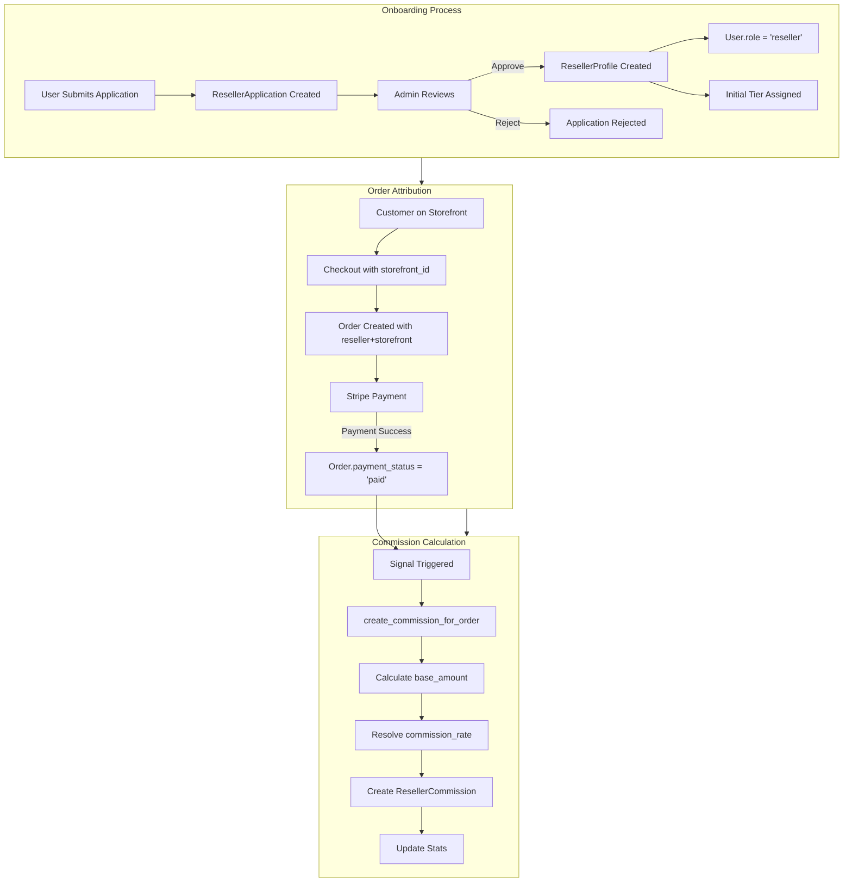
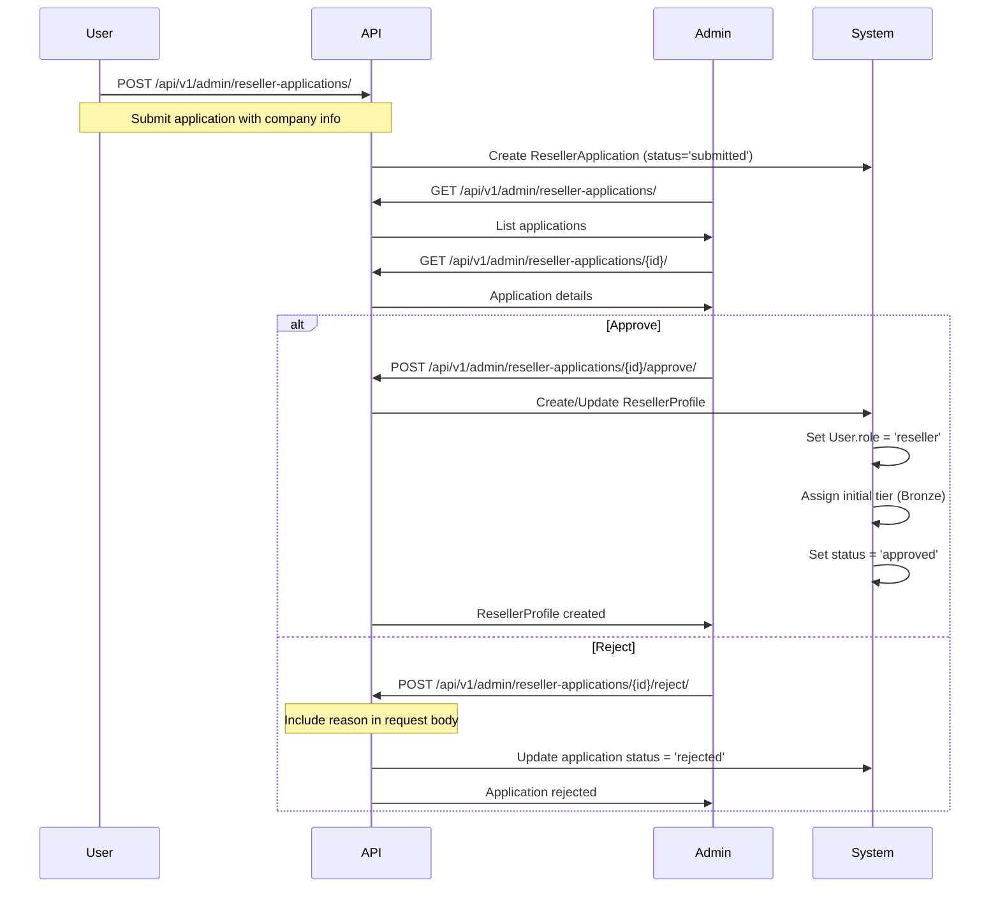
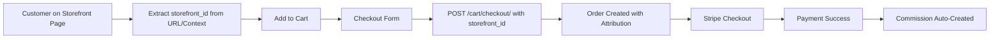
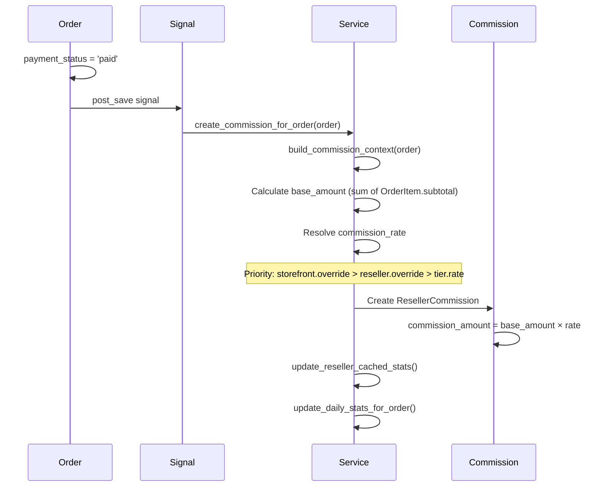

<!-- 17b2e6c1-51df-4841-81e8-fc0c1b8f15f6 2cc40370-edc6-4405-a2f5-4481b800aedd -->
# Reseller System - Complete Documentation

## 1. How Reseller Works in Our Implementation

### Overview

The reseller system is a **commission-based partner portal** (not wholesale pricing). Resellers use digital storefronts to drive retail orders. The brand handles payments, pricing, and fulfillment; the system tracks attribution and calculates commissions.

### Key Concepts

**Reseller**: A business partner (gym, trainer, influencer) with a `ResellerProfile` linked to a `User` with `role="reseller"`.

**Storefront**: A sales surface owned by a reseller (gym screen, QR code, microsite, link). One reseller can have multiple storefronts.

**Tier System**: Commission tiers (Bronze/Silver/Gold/Platinum) with different commission rates. Higher tiers = higher commission rates.

**Attribution**: Orders are attributed to reseller + storefront via `Order.reseller` and `Order.storefront` fields.

**Commission**: Calculated on product subtotal (after discounts, excluding VAT & shipping) when payment succeeds.

### Architecture Flow



### Data Models

**ResellerTier** (`resellers/models.py`):

- Commission rate (0-1, e.g. 0.10 for 10%)
- Min payout threshold
- Display name, description

**ResellerProfile** (`resellers/models.py`):

- OneToOne with `User`
- Links to `ResellerTier`
- Company info, contact details
- Status: `pending`, `approved`, `rejected`, `suspended`
- Cached stats: `lifetime_gmv`, `lifetime_commission`, `orders_count`

**Storefront** (`resellers/models.py`):

- Belongs to `ResellerProfile`
- Has unique `slug` (used in checkout)
- Type: `online`, `physical_screen`, `link`
- Optional `commission_rate_override`

**ResellerCommission** (`resellers/models.py`):

- Links `Order` → `ResellerProfile` → `Storefront`
- Stores `base_amount`, `commission_rate`, `commission_amount`
- Status: `pending`, `earned`, `voided`, `paid`

## 2. Onboarding Process

### Step-by-Step Flow



### Application Fields

- `company_name` (required)
- `website_url`, `app_url` (optional)
- `description` (how they'll promote the brand)
- `location_description` (physical locations/screens)
- `expected_traffic` (simple estimate)
- `user` (optional FK - can be linked later)

### Approval Actions

When admin approves:

1. Creates/updates `ResellerProfile`
2. Sets `User.role = "reseller"`
3. Assigns initial tier (defaults to Bronze)
4. Sets `status = "approved"`
5. Records `approved_at` and `approved_by`

## 3. API Reference

### Reseller Portal APIs (Self-Service)

**Base Path**: `/api/v1/resellers/`

#### Profile & Stats

- `GET /api/v1/resellers/me/` - Get current reseller profile and stats
  - Auth: JWT + `IsResellerUser`
  - Returns: Profile, tier, lifetime stats

- `PATCH /api/v1/resellers/me/profile/` - Update own profile
  - Auth: JWT + `IsResellerUser`
  - Allowed fields: company info, contact details, payout config

#### Storefront Management

- `GET /api/v1/resellers/storefronts/` - List own storefronts
  - Filters: `type`, `is_active`
  - Search: `name`, `slug`, `city`, `country`

- `POST /api/v1/resellers/storefronts/` - Create storefront
  - Required: `name`, `slug`, `type`
  - Optional: location fields, `commission_rate_override`

- `GET /api/v1/resellers/storefronts/{id}/` - Get storefront
- `PATCH /api/v1/resellers/storefronts/{id}/` - Update storefront

#### Product Curation

- `GET /api/v1/resellers/storefronts/{storefront_id}/products/` - List curated products
- `POST /api/v1/resellers/storefronts/{storefront_id}/products/bulk-add/` - Add products
  - Body: `{"product_ids": ["uuid1", "uuid2"]}`
- `DELETE /api/v1/resellers/storefronts/{storefront_id}/products/{product_id}/` - Remove product

#### Commissions & Analytics

- `GET /api/v1/resellers/commissions/` - Commission ledger
  - Filters: `status`, `storefront`, `date_from`, `date_to`
  - Ordering: `earned_at`, `commission_amount`

- `GET /api/v1/resellers/commissions/summary/` - Summary metrics
  - Returns: Current month + last 30 days stats

- `GET /api/v1/resellers/analytics/overview/` - Dashboard analytics
  - Returns: Orders count, GMV, commission, top storefronts
  - Filters: `date_from`, `date_to`

#### Marketing Assets

- `GET /api/v1/resellers/marketing-assets/` - List available assets
  - Filtered by tier visibility rules
  - Filters: `asset_type`

- `GET /api/v1/resellers/marketing-assets/{id}/` - Get asset details

### Admin APIs

**Base Path**: `/api/v1/admin/`

#### Reseller Management

- `GET /api/v1/admin/resellers/` - List all resellers
  - Filters: `status`, `tier`
  - Search: `company_name`, `user__email`

- `GET /api/v1/admin/resellers/{id}/` - Get reseller details
- `PATCH /api/v1/admin/resellers/{id}/` - Update reseller (tier, status, etc.)

#### Application Management

- `GET /api/v1/admin/reseller-applications/` - List applications
  - Filter: `status`

- `GET /api/v1/admin/reseller-applications/{id}/` - Get application
- `POST /api/v1/admin/reseller-applications/{id}/approve/` - Approve application
- `POST /api/v1/admin/reseller-applications/{id}/reject/` - Reject application
  - Body: `{"reason": "..."}`

#### Commission Management

- `GET /api/v1/admin/reseller-commissions/` - Global commission ledger
  - Filters: `reseller`, `storefront`, `status`, `date_from`, `date_to`

- `POST /api/v1/admin/reseller-commissions/{id}/mark-paid/` - Mark commission as paid
  - Body: `{"paid_at": "2025-01-15T10:00:00Z"}` (optional)

#### Analytics

- `GET /api/v1/admin/reseller-analytics/overview/` - Admin analytics
  - Returns: Total orders, GMV, commission, top resellers
  - Filters: `date_from`, `date_to`, `tier`

#### Marketing Assets (Admin)

- `GET /api/v1/admin/marketing-assets/` - List all assets
- `POST /api/v1/admin/marketing-assets/` - Create asset
- `GET /api/v1/admin/marketing-assets/{id}/` - Get asset
- `PATCH /api/v1/admin/marketing-assets/{id}/` - Update asset
- `DELETE /api/v1/admin/marketing-assets/{id}/` - Delete asset

### Checkout Integration

**Endpoint**: `POST /api/v1/cart/checkout/`

**New Field**: `storefront_id` (optional)

- Can be UUID or slug of `Storefront`
- If provided and valid, order is attributed to that storefront and reseller

**Example Request**:

```json
{
  "shipping_address": "123 Main St",
  "city": "London",
  "state": "England",
  "zip_code": "SW1A 1AA",
  "country": "UK",
  "email": "customer@example.com",
  "storefront_id": "gym-alpha-main-entrance"
}
```

**Order Response** includes:

- `reseller_id`
- `storefront_id`
- `storefront_slug`

## 4. Frontend Integration Guide

### Checkout Flow Integration



**Implementation Steps**:

1. **Capture Storefront ID**

   - From URL parameter: `?storefront=gym-alpha-main-entrance`
   - From localStorage/session if navigating from storefront
   - From QR code scan result

2. **Include in Checkout**
   ```typescript
   const checkoutPayload = {
     shipping_address: formData.address,
     city: formData.city,
     state: formData.state,
     zip_code: formData.zipCode,
     country: formData.country,
     email: formData.email,
     storefront_id: storefrontId // UUID or slug
   };
   
   const response = await fetch('/api/v1/cart/checkout/', {
     method: 'POST',
     headers: {
       'Content-Type': 'application/json',
       'Authorization': `Bearer ${token}`
     },
     body: JSON.stringify(checkoutPayload)
   });
   ```

3. **Handle Response**

   - Order includes `reseller_id`, `storefront_id`, `storefront_slug`
   - Can display attribution info in order confirmation

### Reseller Portal Integration

**Authentication**: Resellers use JWT tokens (same as regular users)

**Dashboard Components**:

1. **Profile Overview**
   ```typescript
   GET /api/v1/resellers/me/
   // Display: tier, status, lifetime stats
   ```

2. **Storefronts List**
   ```typescript
   GET /api/v1/resellers/storefronts/
   // Display: name, type, location, is_active
   // Actions: Create, Edit, View Products
   ```

3. **Commissions Ledger**
   ```typescript
   GET /api/v1/resellers/commissions/?status=earned&date_from=2025-01-01
   // Display: Order ID, date, base_amount, commission_amount, status
   // Filters: Status, Storefront, Date Range
   ```

4. **Analytics Dashboard**
   ```typescript
   GET /api/v1/resellers/analytics/overview/?date_from=2025-01-01
   // Display: Orders count, GMV, Commission, Top Storefronts
   // Charts: Time series, Storefront comparison
   ```

5. **Marketing Assets**
   ```typescript
   GET /api/v1/resellers/marketing-assets/
   // Display: Title, type, file/url, description
   // Actions: Download, View
   ```


## 5. Admin Panel Integration

### Reseller Management

**List View** (`GET /api/v1/admin/resellers/`):

- Table columns: Company, Email, Tier, Status, Orders, GMV, Commission
- Filters: Status, Tier
- Search: Company name, Email
- Actions: View Details, Edit, Suspend

**Detail View** (`GET /api/v1/admin/resellers/{id}/`):

- Tabs: Profile, Storefronts, Commissions, Analytics
- Actions: Update Tier, Change Status, Edit Payout Details

### Application Review

**List View** (`GET /api/v1/admin/reseller-applications/`):

- Table: Company, Email, Status, Submitted Date
- Filter: Status
- Actions: Review, Approve, Reject

**Review Flow**:

1. View application details
2. Approve → Creates profile, sets role, assigns tier
3. Reject → Updates status, stores reason

### Commission Management

**Ledger View** (`GET /api/v1/admin/reseller-commissions/`):

- Table: Reseller, Storefront, Order, Date, Base Amount, Commission, Status
- Filters: Reseller, Storefront, Status, Date Range
- Actions: Mark as Paid, Export

**Payout Workflow**:

1. Filter commissions by status = 'earned'
2. Group by reseller
3. Calculate totals
4. Mark as paid after payout
5. Export for accounting

### Analytics Dashboard

**Overview** (`GET /api/v1/admin/reseller-analytics/overview/`):

- Summary cards: Total Orders, GMV, Commission Cost
- Top Resellers table
- Filters: Date Range, Tier
- Charts: GMV over time, Commission by tier

## 6. Commission Calculation Flow



**Commission Rate Resolution**:

1. `Storefront.commission_rate_override` (if set)
2. `ResellerProfile.default_commission_rate` (if set)
3. `ResellerTier.commission_rate` (default)

**Base Amount Calculation**:

- Sum of `OrderItem.subtotal` (product price × quantity)
- Excludes VAT, shipping, discounts (if applied at order level)

## 7. Key Files Reference

- **Models**: `resellers/models.py`
- **Views**: `resellers/views.py`
- **Serializers**: `resellers/serializers.py`
- **Services**: `resellers/services.py`
- **Signals**: `resellers/signals.py`
- **URLs**: `resellers/urls.py`
- **Permissions**: `resellers/permissions.py`
- **Checkout Integration**: `orders/services.py` (create_order_from_cart)
- **Documentation**: `docs/RESELLER_ARCHITECTURE.md`, `docs/RESELLER_BUSINESS_GUIDE.md`

## 8. Testing & Validation

**Test Files**:

- `resellers/tests.py` - Unit and integration tests
- Includes checkout integration tests
- Commission calculation tests
- Signal handler tests

**Manual Testing**:

- Swagger UI: `/api/docs/` - All endpoints documented
- Admin Panel: Django admin for models
- Reseller Portal: JWT authenticated requests